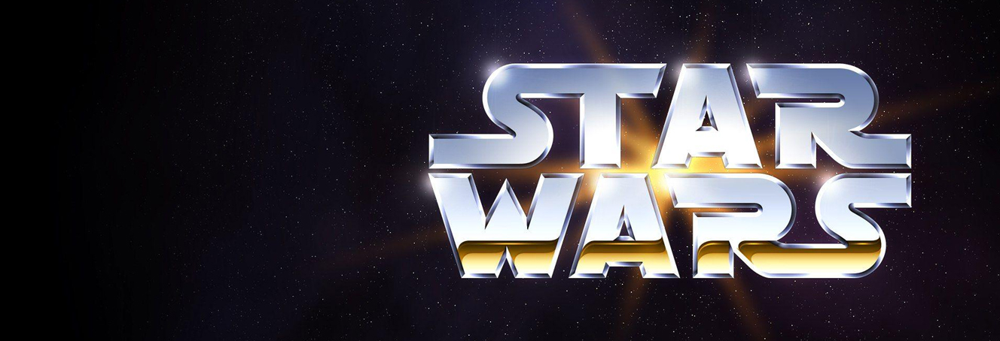

# Week 6 - Research & Planning

Thank you for taking the time to read this week's update. As you can see in the following table, I have a couple of activities planned that I will do in order to get my desired result: Researching & Planning out the Application.

If you have any remarks or questions

## Activities
|What|Finalized|
|:---|:---:|
|Learning Goal & deliverable|✅|
|Choosing a theme|✅|
|Planning|✅|
|Theme research|✅|
|Data & problem|✅|

___

### Learning goal and deliverable
Defining the learning goal and deliverable

I am going to dive deep into front-end coding with **Swift**, and especially **SwiftUI**, Apple's new framework for building UI's with code.

And thus my learning goal shall be:

> Get the hang of Swift and the SwiftUI framework.

Looking back at the first part of this minor, everyone agreed that without clear deliverables set into place, it would become hard to see where we were all going. That's why I have a deliverable set, namely:

> An iOS/macOS application that works on both iPhone and iPad.

### Choosing a theme
> Choosing a theme for the deliverable

Thinking about several themes a few sprung to mind:

#### Audi

#### Star Wars

#### COVID-19

From these themes I decided to go with Star Wars, as it resonated the most with my group of teachers and is easiest to get a lot of meta information about. COVID-19 is a relevant idea, but most of those ideas are already made or are in ongoing development. The Audi application would be cool to link to my real car, but given that most likely needs root access to the car everybody voted against it. There's too little information to be shown without it.

Given that the Star Wars universe is so big, I will focus my application on the Outer Rim Territories and the planets it houses. By doing this I will make sure I set some boundaries and don't get too lost in a galaxy far, far away.

For my theme research I will be using the [Star Wars Fandom Wiki](https://starwars.fandom.com/wiki).

### Planning
Thinking out the next few weeks - planning. You can find this planning on the [README](https://github.com/mwdossantos/kb-86) page as well for the overall project.

|When|What|Finalized|
|:---|:---|:---:|
|Week 6|[Research & Planning](https://github.com/mwdossantos/kb-86/blob/master/docs/week-6-research-and-planning.md)|✅|
|Week 7|[Data Model Design & Design application](https://github.com/mwdossantos/kb-86/blob/master/docs/week-7-data-model-design-and-design-application.md)|🧑🏻‍💻|
|Week 8|Follow Swift Tutorials & Development|🧑🏻‍💻|
|Week 9|application development |🧑🏻‍💻|
|Week 10|Finish develoment & Presentation|🧑🏻‍💻|

### Theme research
Do research on the chosen theme - find images, links and more.

#### Links:
[Star Wars: Official Website](https://www.starwars.com/)

#### Fonts:
[Paralucent](https://www.myfonts.com/fonts/device/paralucent/)

#### Images / inspiration:

### Data & problem
So, what's the problem I'm trying to solve here? Given the vastness of the Star Wars galaxy it can be hard to wrap your head around all the different planets within the universe. I've always wanted to have a clear understanding of at least a couple of planets that appear in the movies and see what their key characteristics are.

This means that my problem can be articulated as the following:

> Currently I find it hard to wrap my head around the all the planets that appear in the Star Wars movies.

From this problem I can define a couple of things:

* The data that I will be working with
* The needs for the application
* The goals for the application

#### The data I will be working with
As I have defined above, the problem describes that there are a lot of planets and information that comes with them. This means that I will need to gather information about the planets I want to include in the application. That is the data.

#### The needs for the application
Now knowing the problem and what data my application will be using, I can define the needs it has to fulfill:

* Ability to browse all the planets in the Outer Rim Territories
* View all meta information about a certain planet
* View historical events that happlicationened on a certain planet
* Be able to easily share a planet with your Star Wars friends

To be sure I can meet those needs I will need to dive deeper into the [Data Model Design](https://github.com/mwdossantos/kb-86/blob/master/docs/week-7-data-model-design-and-design-application.md) in week 7 and think out the requirements.

### Other resources

#### SwiftUI & coding

|What|Resource|Note|
|:---|:---|:---|
|SwiftUI|https://developer.apple.com/xcode/swiftui/|The language I will be using to create the application|
|CMS|https://firebase.google.com/|The CMS (Content Management System) that holds all the information about the planets|
|Learning|https://designcode.io/swiftui?promo=learnswiftui|A tutorial I might check out in week 8, when I start programming the application|
|Figma - to design the application|https://figma.com|My go to tool that I will use to design the application|