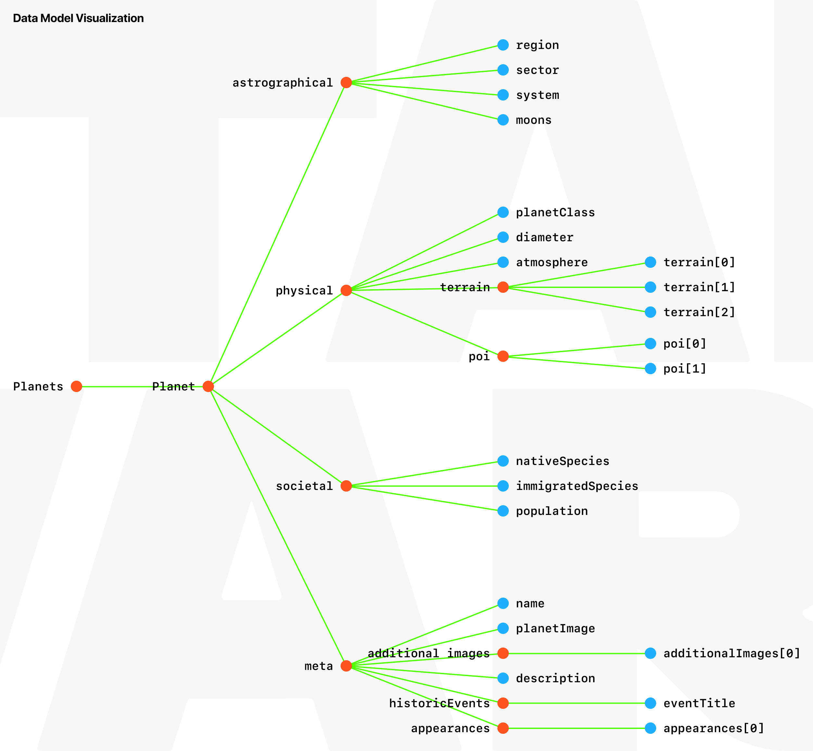
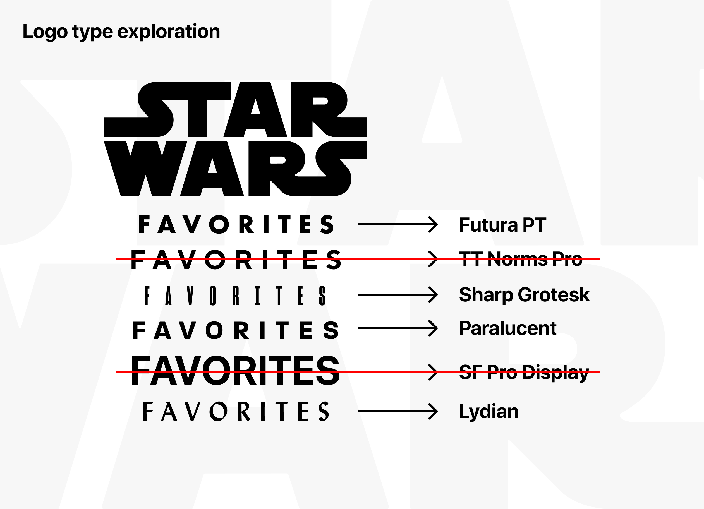
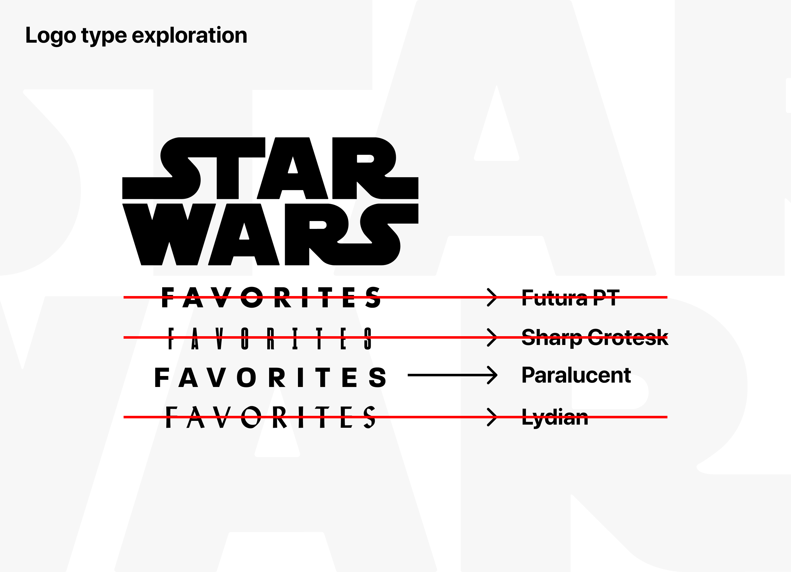
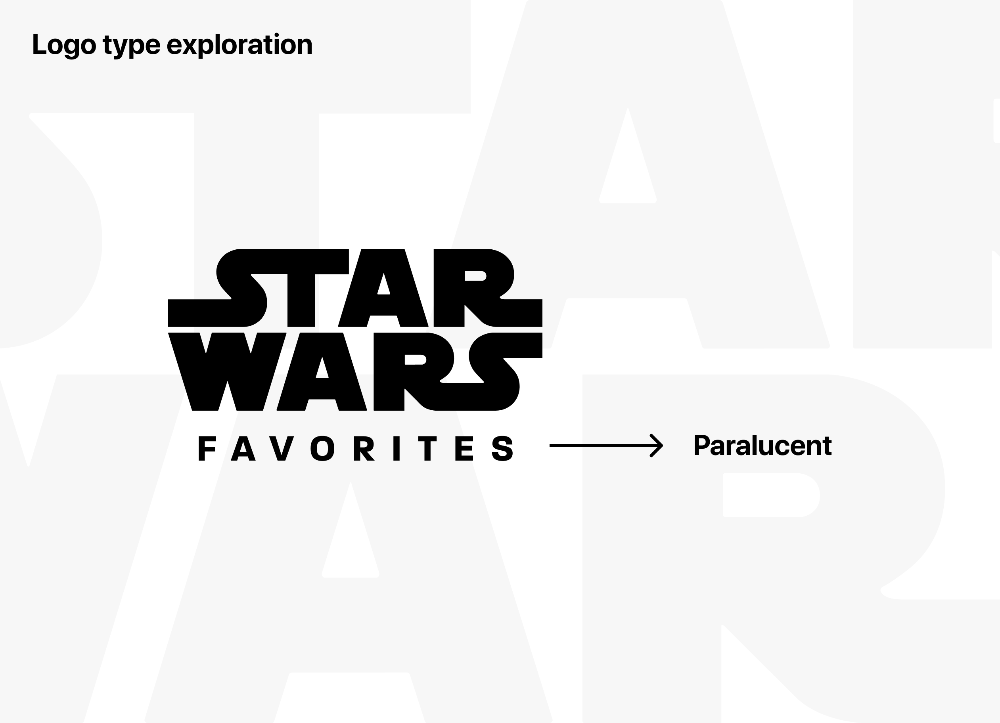
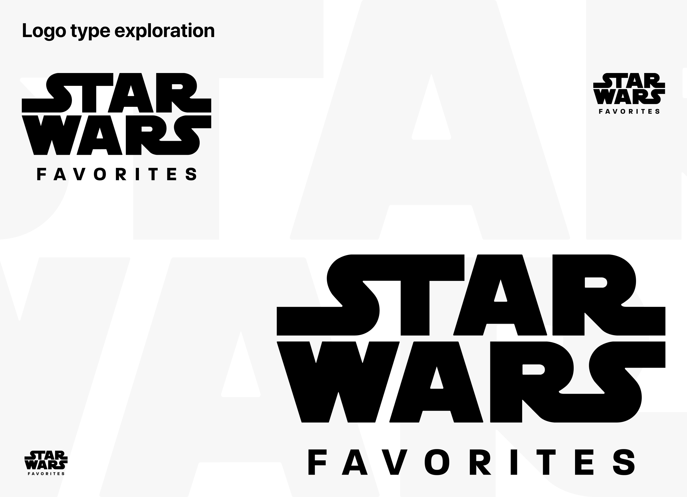

# Week 7 - Data Model Design & Application Design

Again, thank you for taking the time to read this week's update. As you can see in the following table, I have a couple of activities planned that I will do in order to get my desired result: Data Model Design & Application Design.

If you have any remarks or questions

# Activities
|What|Finalized|
|:---|:---:|
|Defining the Data|🧑🏻‍💻|
|Creating a Data Model|🧑🏻‍💻|
|Star Wars: Favorites Logotype|🧑🏻‍💻|
|Sketching out the Screens|🧑🏻‍💻|
|High fidelity application Design|🧑🏻‍💻|

## Defining the Data

With the needs defined in [Week 6](https://github.com/mwdossantos/kb-86/blob/master/docs/week-6-research-and-planning.md):

> * Ability to browse a selection of my most favourtie planets in Star Wars
> * View meta information about a certain planet
> * View historical events that happened on a certain planet
> * See in which movies the planet appears 

come a couple of requirements, namely:

* A simple JSON data structure, as I want to be as efficient as possible
* Mobile ready media for each planet, to get an impression of the planet

In order to properly define the data I will first need to know *what* data I want to display in the application. The easiest way would be to list the movies with all the planets that appear in that particular movie:

### I: The Phantom Menace
* Naboo
* Coruscant
* Tatooine

### II: Attack of the Clones
* Coruscant
* Naboo
* Kamino
* Tatooine
* Geonosis

### III: Revenge of the Sith
* Coruscant
* Utapau
* Kashyyyk
* Mygeeto
* Felucia
* Cato Neimoidia
* Seleucami
* Mustafar
* Polis Massa
* Naboo
* Alderaan
* Tatooine

### Solo: A Star Wars Story
* Corellia
* Mimban
* Vandor-1
* Kessel
* Savareen

### Rogue One: A Star Wars Story
* Lah'Mu
* Wobani
* Coruscant
* Jedha
* Yavin IV
* Eadu
* Mustafar
* Scarif

### IV: A New Hope
* Tatooine
* Alderaan
* Yavin IV

### V: The Empire Strikes Back
* Hoth
* Dagobah
* Bespin

### VI: Return of the Jedi
* Tatooine
* Dagobah
* Endor
* Bespin
* Naboo
* Coruscant

### VII: The Force Awakens
* Jakku
* Takodana
* Starkiller Base
* Hosnian Prime
* D’Qar
* Ahch-To

### VIII: The Last Jedi
* D'Qar
* Ahch-To
* Canto Bight
* Crait

### IX: The Rise of Skywalker
* Ajan Kloss
* Pasaana
* Kijimi
* Kef Bir
* Exegol

### The Mandalorian
* Nevarro
* Arvala-7
* Sorgan
* Tatooine

Now that I have an understanding of the vast amount of planets it's time to make a curated selection of my favorite ones and work on the *meta* information for the planets. I am going to keep it extremely abstract, so that it's reusable. As an example I am going to write out the details about a planet and name all of it's meta content:

> *We're looking at the planet Lah'Mu. It sits in the Lah'Mu system in the Raioballo sector, located deep in the Outer Rim Territories. The planet to the Terrestrial class and has a diameter of 12,618 km. A single moon is also present. The atmosphere is breathable and it's terrain consists of black sand and beaches, fertile lowlands and mountains. On Lah'Mu, there are a couple of points of interest, namely Chief's fortress and the Erso homestead. There is no fauna and humans are the only species on this planet, migrating here.*

In the above text, I have hidden a lot of *meta* information. It still lacks a general description and historic data about the planet, but I will be turning all that into a `JSON` object in the next section, Creating a Data Model. For now however, here's my curated list of favorite planets that I am going to include in the application:

* 

## Creating a Data Model
Given I don't have too much experience yet with JSON I followed this small tutorial from [Mozilla](https://developer.mozilla.org/en-US/docs/Learn/JavaScript/Objects/JSON). It helped me understand the basics about the JSON data format and how I can structure my own JSON files.

All my planets will be stored as `objects` in an `array`. Each object has certain "sub objects" that contain even more information about the planet in different *categories*. The `JSON` below is going to be my data model that I will be working with, and I will need to populate the `JSON` file with all the information from all the planets.

```json
{
    "astrographical": {
        "region": "Outer Rim Territories",
        "sector": "Raioballo sector",
        "system": "Lah'Mu system",
        "moons": 1
    },
    "physical": {
        "planetClass": "Terrestial",
        "diameter": "12,618 km",
        "atmosphere": "Breathable",
        "terrain": [
            "Black sand and beaches",
            "Fertile lowlands",
            "Plateaus & mountains"
        ],
        "poi": [
            "Chief's fortress",
            "The Erso homestead"
        ],
        "fauna": "None"
    },
    "societal": {
        "nativeSpecies": "none",
        "immigratedSpecies": "Humans",
        "population": "Estimated: less than 500"
    },
    "meta": {
        "name": "Lah'Mu",
        "planetImage": "url",
        "additionalImages": [
            "url"
        ],
        "description": "This is a decription",
        "historicEvents": {
            "eventTitle": "eventDescription"
        },
        "appearances": [
            "Rogue One: A Star Wars Story"
        ]
    }
}
```
To visualize this `JSON` object I turned to Figma and created a diagram:



I created four categories for each planet:

* Astrographical
* Physical
* Societal
* Meta

Having these categories will make it easy to focus on the information at hand.

After understanding `JSON` and being comfortable with it I went ahead and populated the whole `JSON` file with all the planets. You can view that file [here](planets.json). With that in place, it's time to start designing with the *data in mind*.

## Star Wars: Favorites Logotype







## Sketching out the Screens


## High fidelity application Design


## Resources

|Resource|Note|
|:---|:---|
|[Star Wars Timeline](https://www.quora.com/Where-does-Solo-fit-in-the-Star-Wars-timeline-1)|Used to determine in which order all the movies should be watched and placed in the application|
|[Star Wars Timeline](https://www.digitalspy.com/movies/a825727/star-wars-timeline-chronology-phantom-menace-to-last-jedi/)|Same as above|
|[Planet flags](http://www.flagsofthegalaxy.com/#outerrimterritories)|Used in the application to give each planet even more uniqueness|
|[Outer Rim Territories wiki](https://starwars.fandom.com/wiki/Outer_Rim_Territories)|To learn more about the history of the Outer Rim|
|[List of all planets](https://starwars.fandom.com/wiki/List_of_planets)|Used to find information about each planet|
|[Planet appearance in the movies](https://www.vulture.com/2017/12/star-wars-planets-ranked-from-coruscant-to-tatooine.html)|To determine which planets appear in which movies|
|[Reddit post about all the planets in all the movies](https://www.reddit.com/r/StarWars/comments/e76c17/list_of_all_planets_by_movie_as_of_1262019/)|To determine which planets appear in which movies|
|[Planet map](https://www.reddit.com/r/StarWars/comments/eg1kws/i_keep_updating_this_legends_map_with_all_canon/)|To see all the planets in the universe|
|[Star Wars SVG logo](https://commons.wikimedia.org/wiki/File:Star_wars2.svg)|To combine with the "Outer Rim" wordmark|
|[Mozilla](https://developer.mozilla.org/en-US/docs/Learn/JavaScript/Objects/JSON)|JSON data tutorial|